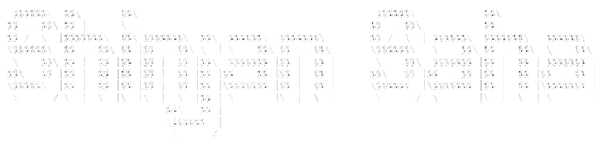

<p align="center">
  
</p>

<div align="center">


<br/><br/>

[](https://www.linkedin.com/in/shinjan-saha-1bb744319/)
[](https://github.com/Code-r4Life)
[](https://www.kaggle.com/shinjansaha123)
[](https://leetcode.com/u/shinjan123/)
[](mailto:shinjansaha00@gmail.com)

</div>

---

## 🧠 About Me

I'm a **Computer Science undergraduate at UEM Kolkata** passionate about building intelligent software that bridges AI research and real-world deployment.

My work spans **Machine Learning**, **Speech AI**, **Deep Learning**, **Generative AI**, and **Full-Stack Development**, with a focus on creating complete end-to-end systems rather than isolated models.

```python
shinjan = {
    "role": "AI/ML Engineer & Software Developer",
    "currently_exploring": [
        "Advanced RAG Architectures",
        "AI Agents",
        "Agentic Workflows"
    ],
    "achievements": [
        "MLX Runner-Up 🥈",
        "BrainoVate Runner-Up 🥈",
        "Multiple Hackathon Finalist 🏆"
    ],
    "philosophy": "Build things that solve real problems."
}
```

---

## 📦 Featured repos

<table>
<tr>
<td width="50%">

### 🚨 [Real-Time Fraud Call Detection](https://github.com/Code-r4Life/Fraud-Call-Detection)
[](https://github.com/Code-r4Life/Fraud-Call-Detection)

Real-time scam call detection using Speech AI, ML ensembles, and semantic analysis.

`Python` `Tensorflow` `XGBoost` `Whisper.cpp` `Librosa` `WebRTC VAD`

</td>
<td width="50%">

### 🤟 [Indian Sign Language Transcription System](https://github.com/Code-r4Life/SignAI)
[](https://github.com/Code-r4Life/SignAI)

Real-time sign language interpretation using MediaPipe, GCN-BiLSTM, and Gemini.

`Python` `Tensorflow` `Mediapipe` `GCN` `BiLSTM` `Gemini API`

</td>
</tr>
<tr>
<td width="50%">

### 📡 [AI-Powered Observability Platform](https://github.com/Code-r4Life/SRE-Copilot)
[](https://github.com/Code-r4Life/SRE-Copilot)

Real-time observability platform combining anomaly detection, telemetry analytics, and LLM-powered incident investigation.

`React` `FastAPI` `LangChain` `Groq LLaMA 3.3` `Scikit-learn` `MySQL`

</td>
<td width="50%">

### 🦺 [Object Detection with YOLOv8](https://github.com/Code-r4Life/Object-Detection-YOLO)
[](https://github.com/Code-r4Life/Object-Detection-YOLO)

Real-time safety equipment detection using YOLOv8 for industrial environments.

`Python` `YOLOv8` `Pytorch` `OpenCV` `Flask` `Ultralytics`

</td>
</tr>
</table>


---
<br>

<div align="center">

## 🧠 Technical Skills

### 💻 Languages


### 🌐 Web Development


### 🧠 AI / ML / Data Science


### 🗄 Databases


### 🤖 GenAI & LLMs


### ☁️ Cloud & Deployment


### 🛠 Tools


</div>

---
<br>

<div align="center">

## 🐍 Contribution Snake


</div>

---
<br>

<div align="center">

## 📊 GitHub Stats


<br><br>

<a href="https://git.io/streak-stats">
  
</a>

<br><br>


<br><br>

</div>

---

<div align="center">

### ✍️ Random Dev Quote 

<p align="center">  </p> 

</div>

---

<p align="center">
  ⚡ Building intelligent systems. Shipping real products. Scaling impact.
</p>
